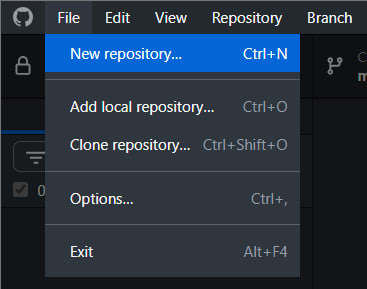
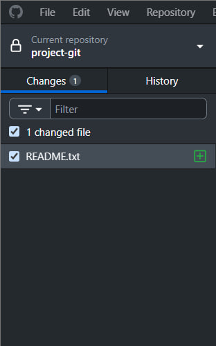
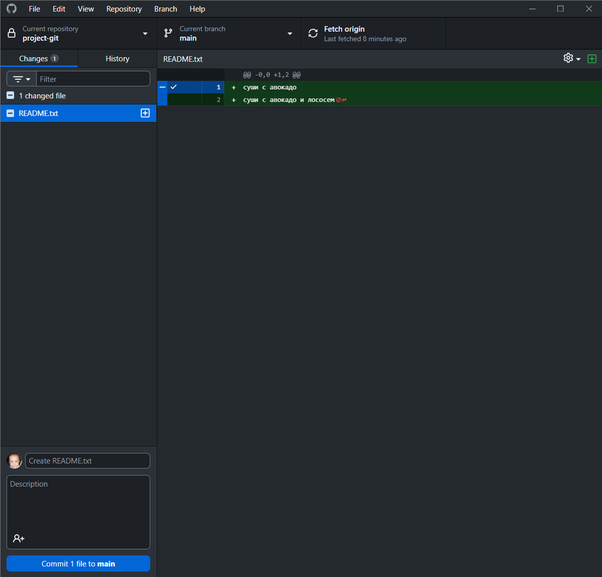
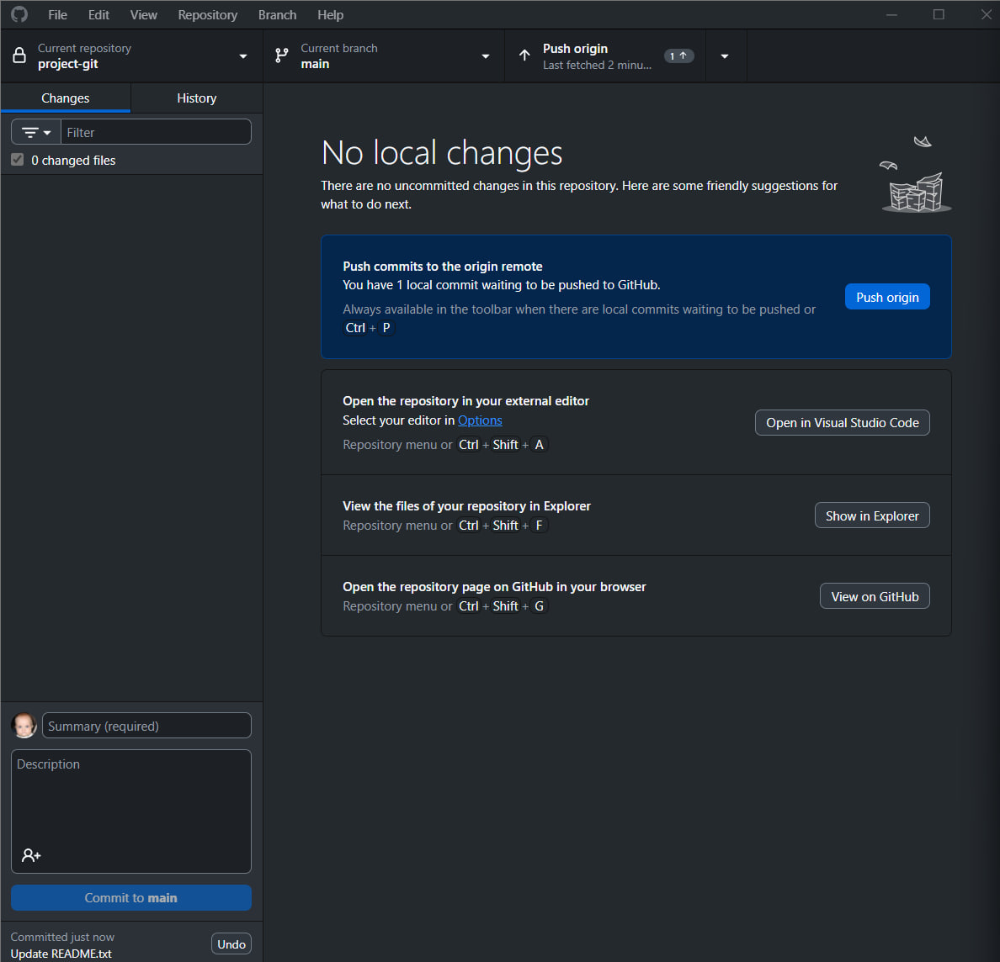
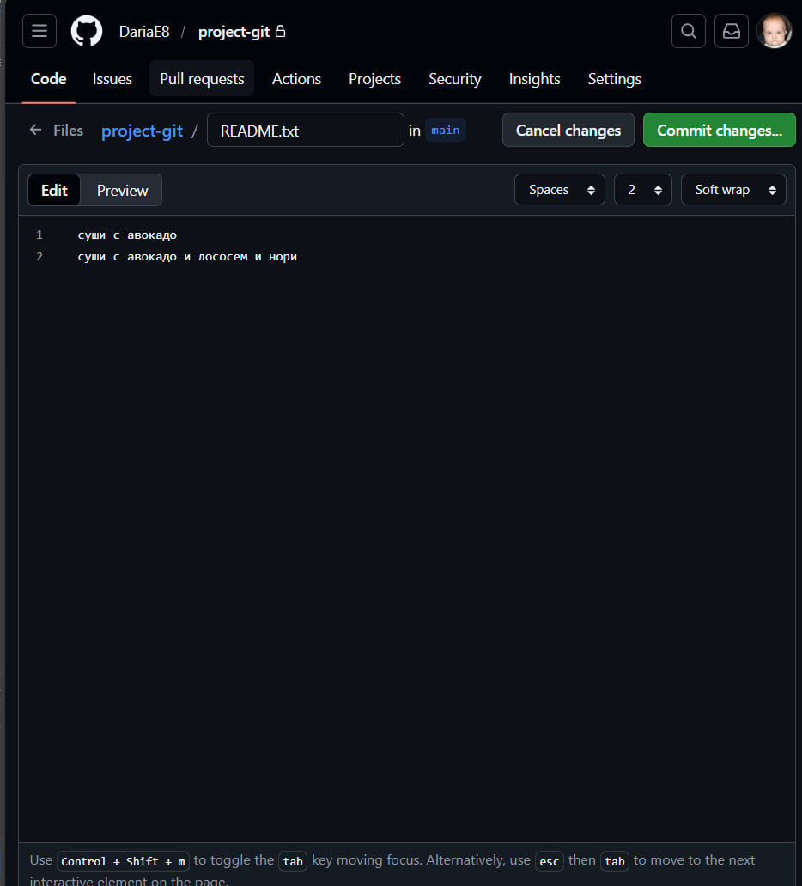
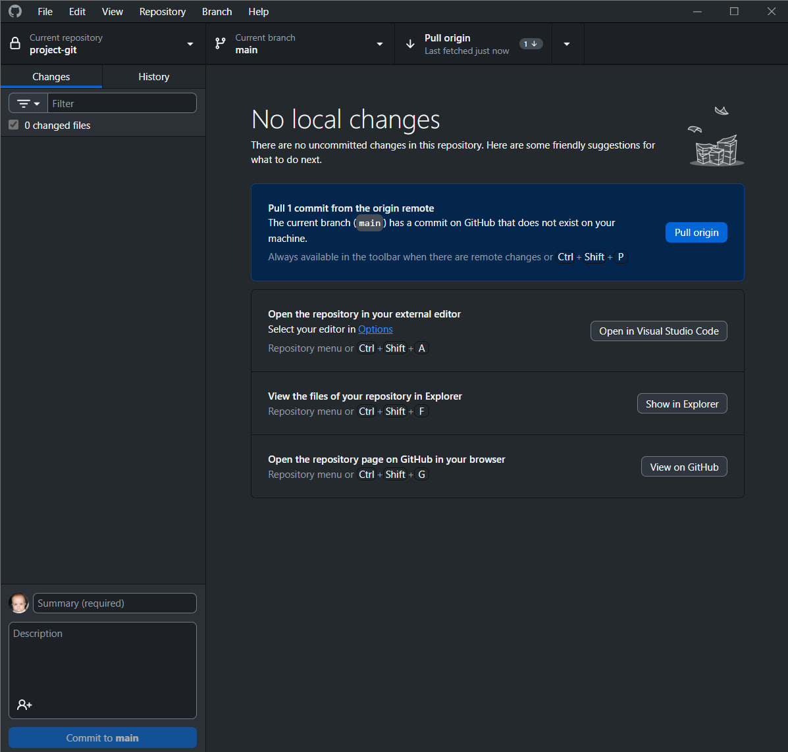
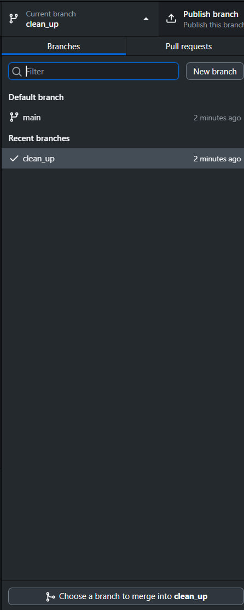
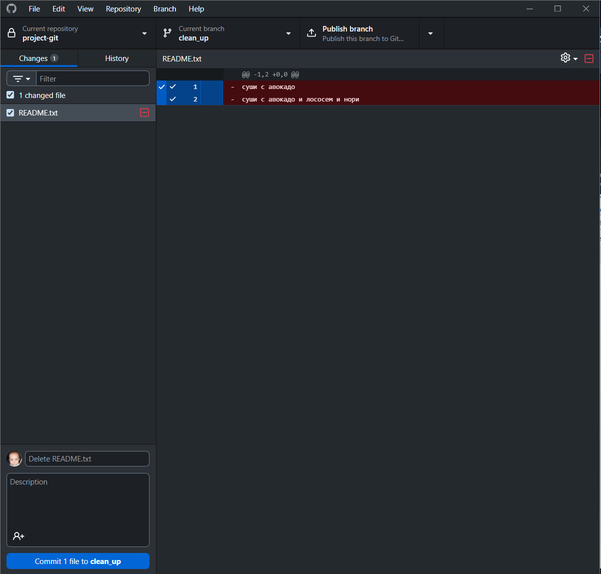
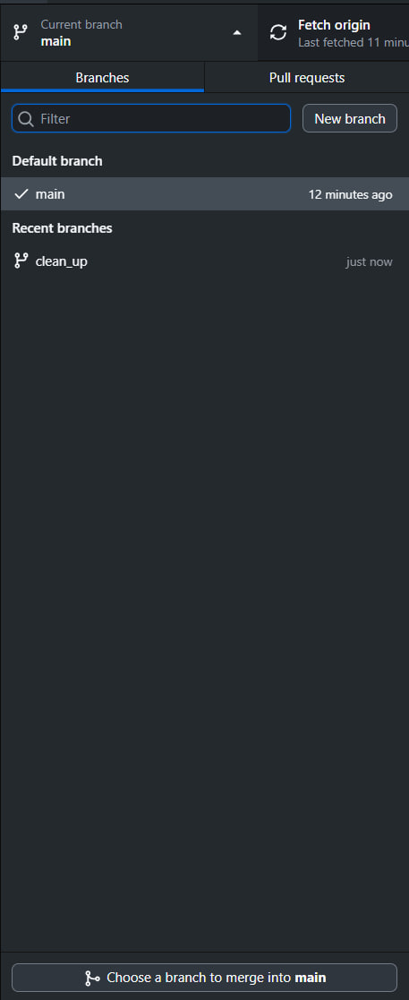
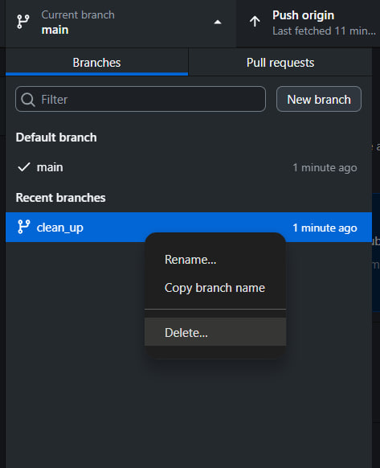

```
1. git init
```


```
2. git add file.txt
```

галочки отмечают stage файлы

```
3. git commit -m "First file"
```

нажимаем Commit 1 file to main в левом нижнем углу

```
4. git push
```

выбираем Push origin в правом верхнем углу

```
5. git pull
```
сначала изменяю файл на гитхабе

а после нажимаю Pull origin в правом верхнем углу в desktop


```
6. git branch branch
```

через кнопку New branch создаем ветку, а чтобы переключиться нажимаем на нужную нам ветку

```
7. rm -r folder и git commit -m 'Delete folder and file'
```

после удаления файла коммитим изменения внутри desktop

```
8. git merge branch
```

сначала переключаемся на главную ветку и нажимаем Choose a branch to merge into main

выбираем ветку для слияния и нажимаем Create a merge commit

```
9. git branch -d branch
```
